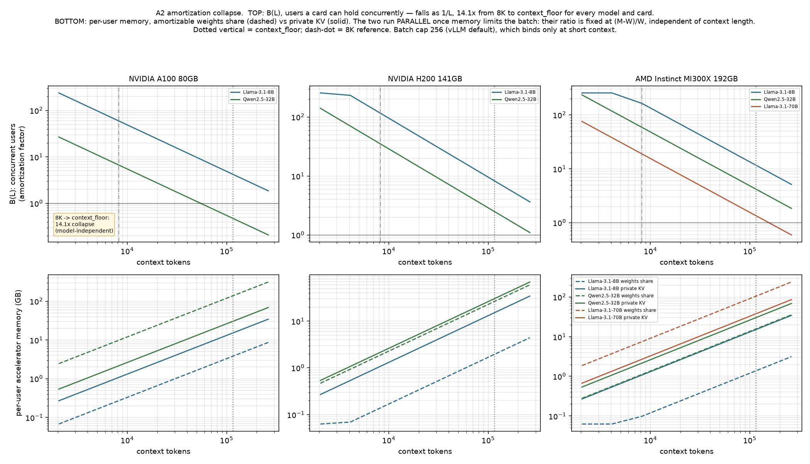

# PHASE 2 — cost structure under the rate card, and the prefill bound

> **STATUS: PHASE 2 COMPLETE (desk work, no hardware).** Arms A, B, C.
> Parameter set: `censor/study_params.yaml` (schema-validated).
> Every T1 row still carries `local_kv_persistence` as the OUTER LOOP.

**SCOPE LINE (Arm A).** Everything below is capacity arithmetic and what it
implies about cost structure. Nothing below is a claim about any provider's
actual serving configuration. Where a minimum batch size appears it is a swept,
unobservable parameter, never an assertion about a deployment.

---

## 1. SANITY — does our batch curve match published measurements? (GATE)

**GATE: PASS.** Worst disagreement
1.18x against a 2x tolerance.

| anchor | published batch | our arithmetic | disagreement | pass (<=2x) |
|---|---:|---:|---:|---|
| RetroInfer A100-80GB / 8B GQA @128K | 4 | 3.72 | 1.07x | PASS |
| HERALD batch @8K | 70 | 59.55 | 1.18x | PASS |
| HERALD batch @32K | 17 | 14.89 | 1.14x | PASS |

The same one-line formula — `(accelerator memory − weights) / (kv_bytes_per_token
× context)` — reproduces an OOM boundary reported by a systems paper and a
batch-vs-context curve reported by a serving paper, to within 18%, with no
fitted parameters. A2 and A3 are built on this.

The single detail that makes it work is reading `n_kv_heads`, not `n_heads`.
Llama-3.1-8B has 32 query heads and 8 KV heads; using 32 would have predicted
batch 0.93 at 128K against a published 4, a 4.3x error that would have failed
the gate in the wrong direction and looked like a memory-capacity finding.

---

## 2. Amortization collapse

### B(L): the amortization factor

Batch is inversely proportional to context, exactly:
`B(L) = (M − W) / (kv_bytes_per_token × L)`.

**Collapse ratio, 8K → context_floor (115,440): 14.09x.**

This is an *analytic* result, not an empirical one: because `B ∝ 1/L`, the ratio
is exactly `115,440 / 8,192` for every model and every accelerator. Numerical
verification across the full grid deviates by
1.8e-15. Moving an agent workload from
short-chat context to production agent context divides the number of users a
given accelerator can serve concurrently by fourteen. Nothing about the model or
the hardware changes that number.



### The result we did not expect: there is no crossover in the memory-limited regime

The brief asked for `L_cross`, the context at which per-user KV exceeds the
per-user weights share — the point batching stops being the dominant economic
lever. Under a purely memory-limited batch, **that point does not exist**:

```
weights_share = W / B(L) = W · kv_pt · L / (M − W)
kv_share      = kv_pt · L
ratio          = (M − W) / W          ← constant in L
```

Both terms scale linearly in context, so their ratio is fixed by the accelerator
and the model, and never crosses. Which of the two dominates is decided entirely
by how much of the accelerator the weights occupy, `W/M` — a provisioning
decision made before any request arrives — and is **invariant to context
length**:

| model | A100 80GB | H200 141GB | MI300X 192GB |
|---|---:|---:|---:|
| Llama-3.1-8B | 3.98:1 | 7.78:1 | 10.96:1 |
| Llama-3.1-70B | weights do not fit | weights do not fit | 0.36:1 |
| Llama-2-7B (MHA contrast) | 4.93:1 | 9.46:1 | 13.24:1 |
| Qwen2.5-32B | 0.22:1 | 1.15:1 | 1.93:1 |
| Qwen3-30B-A3B (MoE) | 0.31:1 | 1.31:1 | 2.15:1 |

Read across a row and the numbers change; read along a context axis and they do
not. An A100 serving an 8B GQA model puts 80% of per-user memory into private KV
at 4K context and still 80% at 256K. The same A100 serving Qwen2.5-32B puts only
18% into KV, at every context length, because the weights already occupy most of
the card.

So the economically load-bearing statement is not "KV eventually wins". It is
that **long context does not shift the balance between amortizable and
non-amortizable memory at all — it just multiplies both.** A provider cannot
batch its way out of long context, and it also does not face a qualitative
regime change at some context length. It faces a linear cost increase with no
offsetting amortization, which is a simpler and more robust claim than the
crossover the brief anticipated.

### B(L) < 1: the datacenter hits the same wall the local box does

The B(L) curves cross below one concurrent user at context_floor for several
model/accelerator pairs that are perfectly comfortable at chat context:

- **Qwen2.5-32B** on a **NVIDIA A100 80GB** reaches B = 0.48 at context_floor — below one.

Below B = 1 the weights no longer amortize across users at all — a single
request occupies the whole card, or the deployment has to shard across cards and
pay interconnect for it. This is the *same* arithmetic that made a 30B-class
model infeasible on a 32GB consumer card in Arm C1, at a different scale. The
constraint is not "datacenters have enough memory and local boxes do not"; both
sides are governed by the same `(M − W) / (kv_pt · L)` and long agent context
pushes both toward the same boundary.

A crossover exists only where something *other than memory* caps the batch. With
a serving-stack cap (vLLM's documented `max_num_seqs` default is 256; carried as
a bracket {32, 256} because it is a deployment choice):

| model | attention | KV KiB/token | weights GB (fp16) | L_cross @cap=32 | L_cross @cap=256 |
|---|---|---:|---:|---:|---:|
| Llama-3.1-8B | GQA | 128 | 16.1 | 3,829 | 479 |
| Llama-3.1-70B | GQA | 320 | 141.2 | 13,466 | 1,683 |
| Llama-2-7B (MHA contrast) | MHA | 512 | 13.5 | 803 | 100 |
| Qwen2.5-32B | GQA | 256 | 65.6 | 7,820 | 978 |
| Qwen3-30B-A3B (MoE) | GQA | 96 | 61.0 | 19,391 | 2,424 |

**L_cross is reported per model, never as one global number, and it does depend
on architecture** — the MHA contrast model crosses at 100 tokens where the MoE
crosses at 2,424, a 24x spread driven entirely by `n_kv_heads` and layer count.
But every one of these sits far below any realistic agent context. Even in the
capped regime where a crossover exists, it has already happened by the time an
agent has finished loading its system prompt.

---

## 3. Threshold check — predicted knee vs published pricing

### Predicted knees (8B GQA class, fp16)

| accelerator | b_min=8 | b_min=4 | b_min=2 | b_min=1 |
|---|---:|---:|---:|---:|
| NVIDIA A100 80GB | 60,978 | 121,956 | 243,912 | 487,823 |
| NVIDIA H200 141GB | 119,152 | 238,304 | 476,608 | 953,217 |
| AMD Instinct MI300X 192GB | 167,789 | 335,579 | 671,158 | 1,342,316 |

`b_min` — the concurrency below which a provider would stop covering cost at the
standard rate — is **unobservable**, so it is swept. That sweep alone spans
60,978–1,342,316 tokens for a single model on three accelerators.

### Published thresholds

| provider | model | published threshold | input multiplier | inside predicted band? |
|---|---|---:|---:|---|
| OpenAI | GPT-5.4 | 272,000 | 2.00x | yes |
| OpenAI | GPT-5.5 | 272,000 | 2.00x | yes |
| Google | Gemini 3.1 Pro | 200,000 | 2.00x | yes |
| Google | Gemini 2.5 Pro | 200,000 | 2.00x | yes |
| Alibaba | Qwen3.5-Plus | 256,000 | 1.25x | yes |
| MiniMax | M3 | 512,000 | 2.00x | yes |
| Anthropic | Claude Sonnet 4.6 / Opus 4.6-4.8 | **none** | n/a | n/a — no threshold to explain |
| DeepSeek | V3.2 / V4 | **none** | n/a | n/a — no threshold to explain |

### VERDICT: the cost structure does NOT explain the pricing. Clean negative.

6 of 6 published thresholds fall
inside the predicted band — but this is a **vacuous pass**. The band spans a
factor of 22, so essentially any threshold a provider could
plausibly choose would land inside it. A test that cannot fail is not evidence.

Three independent observations point the other way:

1. **The numbers look chosen, not computed.** 200K, 256K, and 512K are round
   figures. OpenAI's 272K is the more telling one: GPT-5-class models advertise a
   400K total window with 128K maximum output, and 400K − 128K = 272K exactly.
   That is a product-architecture boundary — the largest input that can coexist
   with a full-length response — not a memory knee.
2. **Providers disagree with each other at the same hardware generation.** 200K,
   256K, 272K, 512K, and "none" coexist. Cost structure is broadly common across
   providers; the thresholds are not.
3. **The decisive falsifier: Anthropic deleted its threshold on a date.** The 2x
   input / 1.5x output surcharge above 200K was eliminated 2026-03-13, with no
   corresponding change in accelerator memory capacity. A cost-driven boundary
   cannot be removed by announcement.

We did not tune `b_min` to make the prediction land, and we are not reporting the
containment as a match. The honest reading is that long-context pricing steps are
commercial positioning, and our arithmetic cannot predict them.

### A4 feedback into `study_params.yaml`

`cloud.long_context_threshold_tokens` moves from `confidence: guess` (value
200,000, "NOT FOUND") to **`confidence: published`, value 272,000** — upgraded
because Arm A3's literature sweep *found a rate card*, **not** because the cost
model derived it. The negative result is recorded in the entry under
`A3_NEGATIVE`, and the one dissenting source is recorded under
`CONFLICTING_SOURCE` rather than dropped. The 128K–400K bracket is retained.

**This changes Phase 1.** context_floor is 115,440 tokens, which is
**below** 272K. At the median turn OpenAI bills the short-context column, so
**every `above_threshold` row in the Phase-1 tables is inapplicable at
context_floor**. The ~2x T2 swing is a tail phenomenon: TraceLab's p90 step
prefix reaches ~467K, which does cross. Phase 3 must apply the threshold per
sampled trajectory, not globally.

---

## 4. Local KV feasibility — which Phase-1 T1 rows survive

Full grid in `kv_feasibility.csv` (hw × model × quant × kv_dtype).

| Phase-1 hw config | 8B feasible at context_floor? | feasible combos | infeasible combos |
|---|---|---:|---|
| `strix_halo` | YES, unconditionally | 6 of 6 | none |
| `apple_m_series` | YES, unconditionally | 6 of 6 | none |
| `discrete_gpu_rtx5090` | YES, but only at some quantizations | 5 of 6 | fp16/kv_fp16 |

**All three Phase-1 T1 rows survive, but the discrete-GPU row survives
conditionally and Phase 1 never checked the condition.** On the RTX 5090, an 8B
model at fp16 weights with an fp16 KV cache tops out at 102,081 tokens — short of
the 115,440-token floor. The row is valid only if you name a
quantization: q4_k_m or q8_0 weights, or fp16 weights with a q8_0 KV cache. That
is consistent with the community benchmarks Phase 1 drew its rates from (which
are quantized), so no Phase-1 number is retracted — but the row must now carry
its quantization, and the 4090 is worse (8B at fp16 weights is infeasible at
either KV dtype).

**`kv_cache_capacity_flag` resolves to FALSE** and moves from `guess` to
`estimated`. A 30B-class model plus a context_floor KV cache does not fit a 24GB
4090 under any combination tested. On the 32GB 5090 it fits in exactly one:
the Qwen3-30B-A3B MoE at q4_k_m weights with q8_0 KV. The dense Qwen2.5-32B never
fits at 115K on 32GB. Note the mechanism this vindicates: the MoE has 4 KV heads
against the dense model's 8, so it carries 96 KiB/token against 256 KiB/token —
the MoE is *feasible where the dense model is not*, at comparable parameter
count, purely because of attention geometry.

Also flagged: **Llama-3.1-70B does not fit context_floor on either unified-memory
box above q4_k_m** (q8_0 weights caps out at 64,049 tokens; fp16 weights do not
fit at all). No Phase-1 conclusion depends on this, since Phase 1 ran the 7–8B
class, but it bounds any future 70B-local claim.

---

## 5. Prefill robustness — ROBUST or FRAGILE, per verdict

Three scaling models at context_floor, relative to pp512
(`c = 3.265e-05` for Llama-3.1-8B, derived from the config, not fitted):

| model | ratio at 115,440 | basis | confidence |
|---|---:|---|---|
| optimistic_flat | 1.000 | Phase 1's implicit assumption | guess |
| linear_attention_theoretic | 0.213 | transformer prefill FLOP accounting | estimated |
| quadratic_pessimistic | 0.0345 | llama.cpp depth anchor, Lc=3598 | estimated |

Spread: 29x. Never averaged.

| kv | hw | longctx | marginal flip rate | marginal | u* flat | u* attention | u* pessimistic | amortized |
|---|---|---|---:|---|---:|---:|---:|---|
| `persists` | strix_halo | below_threshold | 0.27 tok/s | ROBUST | 0.4% | 0.8% | 3.3% | ROBUST |
| `persists` | strix_halo | above_threshold | 0.14 tok/s | ROBUST | 0.2% | 0.4% | 1.7% | ROBUST |
| `persists` | apple_m_series | below_threshold | 0.18 tok/s | ROBUST | 0.6% | 1.6% | 8.1% | ROBUST |
| `persists` | apple_m_series | above_threshold | 0.09 tok/s | ROBUST | 0.3% | 0.8% | 4.1% | ROBUST |
| `persists` | discrete_gpu_rtx5090 | below_threshold | 1.33 tok/s | ROBUST | 0.1% | 0.2% | 0.6% | ROBUST |
| `persists` | discrete_gpu_rtx5090 | above_threshold | 0.68 tok/s | ROBUST | 0.1% | 0.1% | 0.3% | ROBUST |
| `recomputes` | strix_halo | below_threshold | 17.79 tok/s | ROBUST | 7.1% | 34.7% | 402.4% | FRAGILE |
| `recomputes` | strix_halo | above_threshold | 9.07 tok/s | ROBUST | 3.6% | 17.0% | 135.0% | FRAGILE |
| `recomputes` | apple_m_series | below_threshold | 11.85 tok/s | ROBUST | 17.8% | 86.7% | 816.2% | FRAGILE |
| `recomputes` | apple_m_series | above_threshold | 6.05 tok/s | ROBUST | 9.0% | 42.8% | 317.9% | FRAGILE |
| `recomputes` | discrete_gpu_rtx5090 | below_threshold | 85.98 tok/s | ROBUST | 1.3% | 5.8% | 47.7% | FRAGILE |
| `recomputes` | discrete_gpu_rtx5090 | above_threshold | 43.86 tok/s | ROBUST | 0.6% | 2.9% | 20.2% | FRAGILE |

### The marginal verdict is ROBUST

Local wins on energy-only cost in **every** cell, under **every** scaling model.
The rates at which cloud would take over are 0.09–86 tok/s; even the pessimistic
model leaves local at 30.6–292 tok/s at context_floor. The tightest cell is
`recomputes` / RTX 5090 / below_threshold, and it still clears its flip rate by
3.4x. Phase 1's headline — *cost is not the hybrid question on marginal terms* —
survives the interpolation attack intact.

### The Apple / `recomputes` conditional does NOT survive. FRAGILE.

This was the question. Phase 1 reported that Apple under `recomputes` needs
`capex_utilization >= 17.8%` at 36 months. Inverting on the prefill rate:

| scaling model | prefill rate at floor | turn seconds | u* required |
|---|---:|---:|---:|
| optimistic_flat | 886 tok/s | 133 s | **17.8%** |
| linear_attention_theoretic | 189 tok/s | 614 s | **86.7%** |
| quadratic_pessimistic | 31 tok/s | 3776 s | **816.2%** — impossible |

**u\* range across the three models: 17.8% → impossible.**

The 17.8% figure was an artifact of assuming prefill throughput does not degrade.
It is the *optimistic edge of a bracket*, not a central estimate. Against the
TraceLab utilization anchor (human-idle-capped 14.5%), the conditional already
fails at the optimistic edge, and by the attention-theoretic model — which is
just FLOP counting on a sourced config — Apple needs 86.7%
utilization, which no plausible agent stream supplies. Under the pessimistic
model amortized local cannot win at any utilization.

Every `recomputes` row is FRAGILE on the amortized comparison. Every `persists`
row is ROBUST (worst case 8.1%, under the 14.5% anchor). **The prefill
interpolation attack does not damage the study's conclusions — it sharpens them
onto `local_kv_persistence`.** Whether the local runtime holds KV across turns
was already the largest lever; Arm B removes the one surviving case where
`recomputes` was defensible.

---

## 6. The one hardware measurement to make first

**Measure cold prefill throughput as a function of prompt length on the 7–8B
class, at depths 512 / 8,192 / 32,768 / 65,536 / 115,440.**

Not a single 115K number. The point is to discriminate the three scaling models,
and they separate at different depths:

| depth | flat | attention-theoretic | pessimistic | flat/attn | attn/pess |
|---:|---:|---:|---:|---:|---:|
| 512 | 1.000 | 1.000 | 1.0000 | 1.00x | 1.00x |
| 2,048 | 1.000 | 0.953 | 0.7280 | 1.05x | 1.31x |
| 4,096 | 1.000 | 0.897 | 0.5342 | 1.12x | 1.68x |
| 8,192 | 1.000 | 0.802 | 0.3486 | 1.25x | 2.30x |
| 16,384 | 1.000 | 0.662 | 0.2057 | 1.51x | 3.22x |
| 32,768 | 1.000 | 0.491 | 0.1130 | 2.04x | 4.35x |
| 65,536 | 1.000 | 0.324 | 0.0595 | 3.09x | 5.45x |
| 115,440 | 1.000 | 0.213 | 0.0345 | 4.69x | 6.17x |

- **8,192 tokens** is the shallowest depth where attention-theoretic and
  pessimistic differ by ≥2x — cheap to run, and it already kills one model.
- **32,768 tokens** is where flat and attention-theoretic separate by ≥2x —
  this is what falsifies the Phase-1 assumption.
- **115,440 tokens** is the operating point, where the models span
  29x.

`llama-bench` supports this directly via `-d` (prefilled-context depth), and its
reported run-to-run stddev is sub-1% on stable backends, so a 2x separation is
far outside noise. One sweep, one afternoon, and the widest remaining bracket in
the study collapses.

Second priority, and it is not a measurement: **decide `local_kv_persistence`.**
Arm B shows the amortized verdict is FRAGILE under `recomputes` on all three hw
configs and ROBUST under `persists` on all three. That is a runtime software
choice, resolvable by reading a serving stack's documentation, and it dominates
anything a wattmeter will tell us.

---

## Guardrails in force

- Arm A stayed on the economics side: cost structure and capacity arithmetic
  only. No claim about any provider's internal configuration appears above.
- A3 returned a negative and it is reported as a negative. `b_min` was swept, not
  tuned.
- Longctx bounds and the three prefill scaling models are carried as brackets
  throughout. No midpoints.
- `local_kv_persistence` is the outer loop in every T1 table.
- The A1 gate ran before A2/A3 were built.
- No policy search, trajectory sim, DES, quality model, or thermal model.
