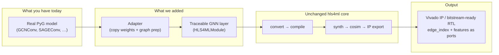

# GNN Support in hls4ml — Results Summary
**For:** Prof. Hao · **From:** [Your name] · **Date:** June 2026

> *Plain-language summary of what was built, what was verified, and how it relates to GNNBuilder / the hls4ml platform paper.*

---

## Slide 1 — The question

**Can we add GNN support to hls4ml the way the platform paper says is still missing?**

The hls4ml paper notes:
- Generic GNN / PyTorch Geometric support is **not available yet**
- Custom ops can be added via the **Extension API**

Our goal: take a **real PyG GNN** (e.g. GCNConv) and run it through hls4ml’s normal flow to **FPGA RTL**, not a separate standalone tool.

---

## Slide 2 — Why this is hard (3 blockers)

| Blocker | What it means |
|--------|----------------|
| **Graph is runtime data** | Connectivity is `edge_index`, not a fixed weight matrix — must be an **input port** on the FPGA |
| **Message passing ≠ Dense/Conv** | GNN = combine → gather neighbors → aggregate → update; hls4ml has no such layer |
| **PyG isn’t traceable** | hls4ml uses `torch.fx`; PyG’s `MessagePassing.propagate()` can’t be traced automatically |

**Bottom line:** We can’t paste `GCNConv` into hls4ml and press go. We had to **add graph layers to hls4ml** and **bridge from PyG**.

---

## Slide 3 — Our approach (one picture)

**Same idea as GNNBuilder** (message-passing templates → HLS), but **inside hls4ml** so HEP users stay in one toolchain.

---

## Slide 4 — What “solved” looks like (checklist)

| Requirement | Done? | Evidence |
|-------------|-------|----------|
| GNN layer registered in hls4ml | ✅ | `hls4ml_gnn.register()` wires Extension API |
| Graph connectivity at runtime | ✅ | RTL ports: `x` + `edge_index` |
| Real PyG layer, not reimplemented math | ✅ | `from_gcnconv()` / `from_sageconv()` |
| Float match to PyG before HLS | ✅ | GCN: **0.0** error · SAGE: **~0** error |
| Full hls4ml build (not hand-written TCL) | ✅ | C-sim → synth → **cosim Pass** → IP zip |
| Fits target FPGA | ✅ | GCN @ 12,4: **81% DSP, 39% LUT** |

---

## Slide 5 — Verified results (numbers)

**Device:** Xilinx `xczu3eg-sbva484-1-e` · **Tool:** Vitis HLS 2025.2.1 · **Precision:** `ap_fixed<12,4>`

### GCNConv (torch_geometric) — full pipeline ✅

| Metric | Result |
|--------|--------|
| PyG vs our adapter (float) | **0.000** max error — exact |
| PyG vs hls4ml (fixed-point) | **0.043** max error |
| Clock | **259 MHz** estimated |
| Resources | 81% DSP · 39% LUT · 17% FF |
| C/RTL co-simulation | **Pass** |
| Deliverable | Exported Vivado IP (`impl/export.zip`) |

### SAGEConv (torch_geometric) — synthesis ✅

| Metric | Result |
|--------|--------|
| PyG vs adapter (float) | **~0** max error |
| PyG vs hls4ml (fixed-point) | **0.028** max error |
| Resources | 61% DSP · 85% LUT |

### Multi-layer GNN (2 graph layers + ReLU) — correctness ✅

| Metric | Result |
|--------|--------|
| Torch vs hls4ml | **0.005** max error |
| Note | Needs `ap_fixed<12,4>` to fit (2 layers at 16,6 overflow LUT) |

*GIN, GAT, EGNN: implemented; pending full server verification after file sync.*

---

## Slide 6 — What the accelerator actually is

**Inputs (runtime):**
- Node features `x` — shape `[N, F]`
- Graph `edge_index` — PyG COO format `[2, E]`

**Inside the FPGA (one message-passing layer):**
1. **Combine** — linear transform per node (`x @ W`)
2. **Aggregate** — scatter messages along edges (sum / mean / GCN norm)
3. **Update** — bias, optional MLP / attention (layer-dependent)

**Output:** Updated node features `[N, F_out]`

Same graph, different `edge_index` each inference — up to compile-time max `(N, E)`.

---

## Slide 7 — GNNBuilder vs this work

| | **GNNBuilder (FPL 2023)** | **This work (`hls4ml_gnn`)** |
|--|---------------------------|------------------------------|
| Role | Standalone GNN → HLS generator | **Plugin for hls4ml** |
| Audience | GNN + FPGA experts | **Existing hls4ml users (HEP, etc.)** |
| Front-end | Own PyTorch parser | hls4ml + PyG **adapters** |
| Message passing | Template library | Same math, **`nnet_graph.h` kernels** |
| Output | HLS / IP / bitstream | Same, via **hls4ml build()** |

**Relationship:** Reuse GNNBuilder’s *message-passing insight*; deliver it where the platform paper says GNNs are missing — **inside hls4ml**.

---

## Slide 8 — What we are *not* claiming (scope)

- ❌ Automatic import of **any** arbitrary PyG model by tracing `MessagePassing`
- ❌ Unlimited dynamic graph size (bounded by compile-time `N`, `E`; padding for smaller graphs)
- ❌ Yet merged into upstream hls4ml (drop-in extension package today)

---

## Slide 9 — Ask for you

**Does this match the contribution you had in mind?**

1. **Yes — hls4ml GNN extension** → polish for upstream / paper
2. **Broader PyG coverage** → finish GIN/GAT verification, multi-layer demos
3. **Phase B (3D co-design)** → feed these csynth numbers into cost model
4. **Something else** → [your direction]

Happy to do a **15-min walkthrough** with one live demo on the server if easier than reading.

---

## Appendix — Artifacts (if you want to dig later)

| What | Where |
|------|--------|
| Extension package | `hls4ml_gnn/` (zip sent separately) |
| GCN demo + verified IP | `run_hls4ml_gnn_pyg.py` → `hls4ml_gnn_pyg_prj/` |
| SAGE demo | `run_hls4ml_gnn_sage.py` |
| Research framing | `docs/research_positioning.md` |

*No code required to understand Slides 1–9.*
