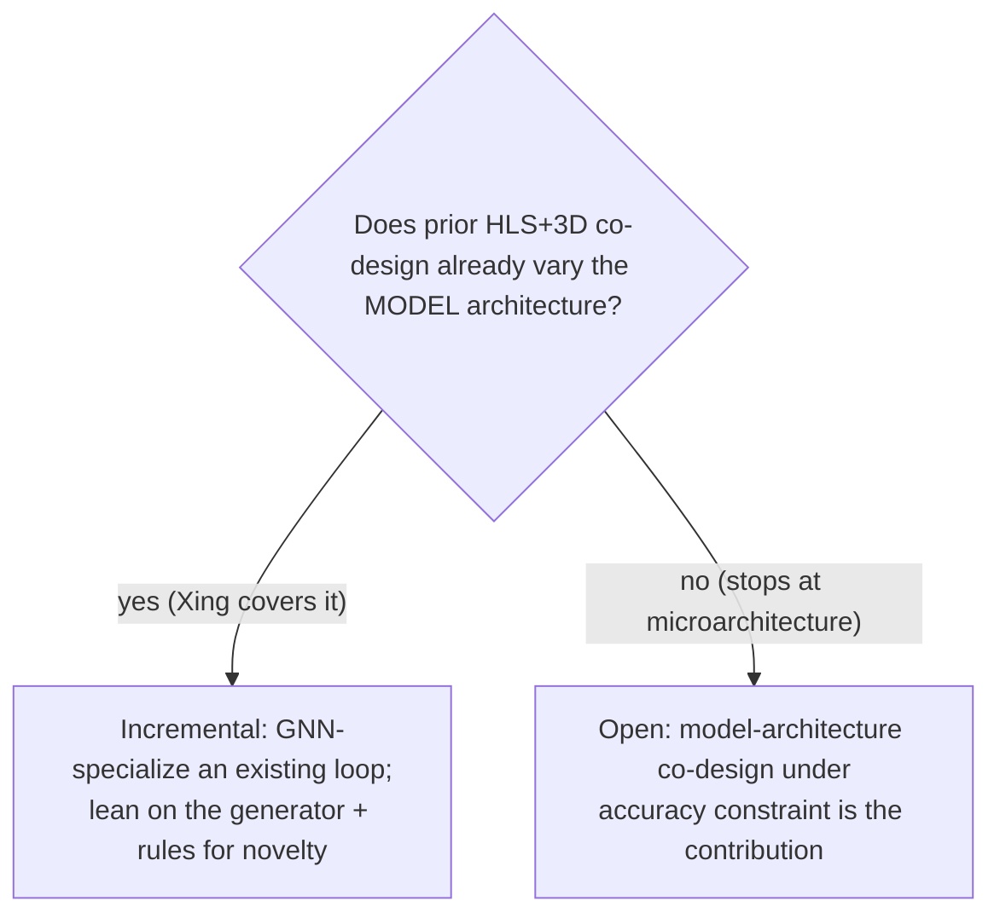

# Research positioning: HLS-generative GNN accelerators + 3D-IC co-design

Working positioning note for the SHARC Lab (Dr. Callie Hao) discussion. Drafts
the "how we differ" paragraphs against the flagship prior work and isolates the
plausibly-open slice. Paper claims below are from the proposal's reference
summaries plus general knowledge; items tagged **[VERIFY]** must be confirmed by
reading the primary source end-to-end before being quoted.

## The plausibly-open slice (one sentence)

> HLS-**generative** GNN accelerators (GNNBuilder / hls4ml lineage, FPGA) +
> HLS-level 3D co-optimization + **transferable GNN-architecture design rules**,
> on an **equivariant / point-cloud** workload.

Each pillar alone is occupied; the intersection is what we must show is open
relative to the Lim / Krishna roadmap.

## Prior art and how we differ

### Xing & Srivastava, "A High-Level Approach to Co-Designing 3D ICs" (DAC 2024)
- **What it does [VERIFY]:** integrates HLS and 3D macro placement in one loop
  for timing closure — lifts 3D-awareness into the high-level flow.
- **How we differ:** their loop optimizes a *fixed microarchitecture* for timing;
  we (a) target GNNs specifically and exploit the aggregate/combine seam as the
  tier cut, (b) add energy + thermal + TSV as first-class coupled objectives,
  and (c) push past microarchitecture co-design to **model-architecture**
  co-design (vary layers/width/aggregation/precision under an accuracy
  constraint). **This paper decides our framing:** if Xing already co-designs the
  model architecture, we are incremental; if it stops at the microarchitecture,
  the model-level co-design is the open contribution. *Read this first.*

### HePGA (3D heterogeneous PIM GNN accelerator, 2025)
- **What it does [VERIFY]:** maps GNN kernels to tiers under thermal/power
  constraints via workload-aware DSE on a 3D-stacked PIM substrate.
- **How we differ:** HePGA is a PIM/ASIC substrate with a bespoke mapper; ours is
  an **HLS-generative FPGA/ASIC** flow where the partition is an HLS-level
  decision and the workload is *generated* (so the sweep is automatic and the
  same artifact feeds both the experiment and the surrogate corpus). We also aim
  for **transferable rules**, not a single optimized mapping.

### GCNim (GCN accelerator on 3D-stacked PIM, 2023)
- **What it does [VERIFY]:** exploits the GCN aggregate/combine split on
  3D-stacked processing-in-memory.
- **How we differ:** confirms the aggregate/combine-on-3D insight is real (good
  for motivation, bad for novelty of the *insight*). Our delta is the
  generative-HLS angle, the equivariant workload, and rules — not "GNNs benefit
  from 3D," which GCNim already shows.

### TP-GNN (Lu et al., Sung-Kyu Lim, DAC 2020)
- **What it does [VERIFY]:** a GNN *as the method* for tier partitioning in
  monolithic 3D ICs.
- **How we differ:** TP-GNN uses a GNN to partition a generic netlist at physical
  design; we use a GNN surrogate to predict **3D QoR of GNN accelerators** at the
  HLS level for DSE. Same tool family, different layer of the stack and different
  object. Risk: methodological overlap in "GNN predicts 3D quality" — position
  carefully.

### Joseph, Samajdar, Lim, Krishna et al., "Architecture, Dataflow and Physical
Design Implications of 3D-ICs for DNN Accelerators"
- **What it does [VERIFY]:** characterizes when 3D helps DNN accelerators
  (workload/dataflow/physical-design implications).
- **How we differ:** that work is dense DNNs; GNNs have runtime-data-dependent,
  gather/scatter, variable-size connectivity that breaks the dense-dataflow
  assumptions — so its conclusions do not transfer for free. Our rules are the
  GNN-specific analogue.

### Generator lineage (not 3D, establishes the floor)
- **GNNBuilder (Abi-Karam & Hao, FPL 2023):** message-passing template
  methodology we bring into hls4ml. **hls4ml platform paper (2025):** documents
  the missing generic-GNN / PyG support — the gap Phase A fills. **FlowGNN
  (HPCA 2023), lui-gnn / wa-hls4ml (2025):** dataflow + surrogate lineage we
  extend from 2D to 3D labels.

## The framing fork (resolve with Xing + Callie)

- **Microarchitecture co-design** (tune partition/precision of a fixed model):
  lower-risk, likely overlaps Xing/HePGA.
- **Model-architecture co-design** (vary the GNN itself under fixed accuracy,
  extract rules): the ambitious, plausibly-open version — and the one our
  `cost_model_3d/sweep.py` + `rules.py` are built to deliver.

## Questions for Callie (the things only she can answer)

1. Is the slice above open relative to the Lim / Krishna roadmap, or already
   claimed inside the group?
2. Tooling depth: **Level 1** (Vitis HLS as black box, all 3D intelligence in the
   generator/DSE layer — the GNNBuilder pattern, what this repo implements) or
   **Level 2** (modify an open HLS compiler — Bambu / CIRCT-MLIR — to make
   scheduling/binding tier-aware)?
3. Framing: microarchitecture co-design (incremental) or model-architecture
   co-design (ambitious)? Xing's actual scope decides this.
4. Is a clean **conditional / negative** result ("3D-aware HLS helps GNNs only
   when X") publishable in the venues she targets, or is a positive headline
   required?

## Immediate reading + reproduction checklist

- [ ] Read Xing & Srivastava (DAC 2024) end-to-end; fill the **[VERIFY]** above;
      write the final "how we differ" paragraph.
- [ ] Read HePGA end-to-end; confirm PIM-vs-HLS and mapper-vs-generative deltas.
- [ ] Reproduce one GNNBuilder accelerator end-to-end; map hls4ml `ModelGraph`
      IR + backend templates to the attach seam (this repo's `hls4ml_gnn/`
      mirrors that seam — confirm it lines up with current upstream).
- [ ] Bring this note + the prior-art list to Callie; resolve the four questions.
