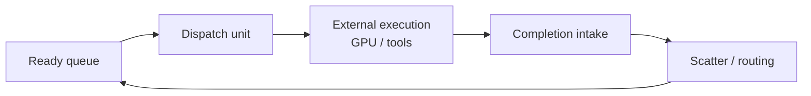

# Microarchitecture

## Closed loop



## On-chip memories

| Structure | Role |
|-----------|------|
| CSR graph store | Successor lists (`row_ptr`, `col_idx`) |
| Readiness counters | `preds_remaining`; 0 ⇒ eligible |
| Ready queue | Nodes with satisfied dependencies |
| MSHR table | Outstanding external tasks keyed by node id |
| Graph op queue | Runtime append / prune / fire-mode updates |

## Scatter (O(out-degree))

On completion of node `u`:

```
for v in successors(u):
    apply_fire_mode(v)   // all-of | any-of | threshold
    if ready(v): enqueue ready queue
```

No scan over all waiting tasks.

## Fire modes

| Mode | Ready when |
|------|------------|
| ALL_OF | Every predecessor completed |
| ANY_OF | Any predecessor completed |
| THRESHOLD | Completed preds ≥ (total − threshold) |

Graph Harness all-of joins force unnecessary serialization; threshold / any-of
are deliberate generalizations.

## MSHR-style outstanding waits

External tasks dominate latency. The engine optimizes for:

- Holding **many** outstanding dispatches without blocking the scatter path
- **Matching completions** to dependents by node id (hash / direct index)
- **Not** optimizing local dispatch latency (Picos focus)

## Dynamic graph (research core)

Operations:

- `APPEND_NODE` — new sub-agent from planner
- `APPEND_EDGE` — dependency or result route
- `PRUNE_SUBTREE` — kill speculative branch
- `SET_FIRE_MODE` — conditional fan-out metadata

Software reference: `software/engine_sim.cpp` (`oe_graph_op` queue).

HLS: not yet integrated — graph mutations remain host-side in scaffold.

## Speculation (simplified in scaffold)

When predicted completion is confident, downstream readiness may advance early.
On prune or late mismatch, rollback restores predecessor counts (software sim).
Full MSHR-shadow state is Phase 2 HLS work.

## Datacenter parallelism

Read-only graph during scatter traversal → shared across worker replicas
(LightningSim V2 parallel-DSE property transferred to runtime scheduling).

## HLS decomposition (target DATAFLOW)

| Stage | Responsibility |
|-------|----------------|
| `graph_mutator` | Drain op queue, update CSR |
| `dispatch` | Ready queue → MSHR + external issue |
| `completion_intake` | Match returning completions |
| `scatter` | `oe_hls_scatter_step` |

Current `hls/orchestration_engine.cpp` implements scatter + batched completion
processing only — other stages stubbed.

## Software baseline

`software/cpu_baseline.cpp` — global scan over all nodes each cycle/event to
find ready work. Correct but O(nodes) per event; models conventional thread-pool
coordination.

## Evaluation metrics

| Metric | Meaning |
|--------|---------|
| `dispatch_cycles + scatter_cycles + graph_mut_cycles` | Coordination overhead |
| `mshr_peak` | Outstanding concurrency pressure |
| `speculation_rollbacks` | Branch misprediction cost |
| LightningSim cycles | Hardware kernel cost (post-cosim) |

Compare engine vs CPU baseline vs external-task floor (`T_io`).
